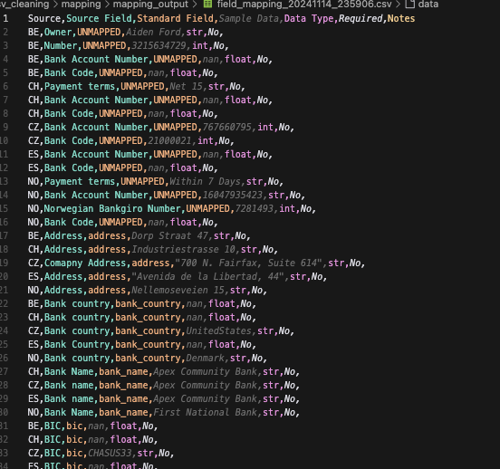
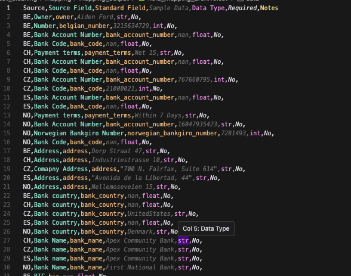

# Vendor Data Processing Pipeline

A robust Python-based data processing pipeline for cleaning, standardizing, and consolidating vendor data from multiple sources. This project provides a systematic approach to handle vendor data transformation with features for deduplication, standardisation, and analysis.

## Features

- **CSV Cleaning & Standardisation**
  - Header detection and standardisation
  - Empty row removal
  - Merged cell handling
  - Duplicate row detection and removal

- **Vendor Data Analysis**
  - Column comparison across multiple files
  - Detailed analysis reports
  - Sample data inspection
  - Column mapping suggestions

- **Data Mapping**
  - Field standardisation
  - Mapping matrix generation
  - Interactive mapping review process
  - Automated mapping refresh

- **Data Consolidation**
  - Vendor deduplication
  - Data standardisation
  - Field consolidation
  - IBAN/VAT number formatting

## Project Structure

```
vendor-data-pipeline/
├── cleaning/
│   ├── clean_vendor_data.py
│   ├── csv_cleaner_hdr.py
│   └── deduplicate_and_consolidate.py
├── mapping/
│   ├── analyse_vendors.py
│   ├── create_mapping.py
│   └── refresh_mapping_matrix.py
├── utils/
│   └── data_consolidation.py
├── data/
│   ├── raw/
│   ├── cleaned/
│   └── processed/
├── pre_mapping_process.py
└── post_mapping_process.py
```

## Installation

1. Clone the repository:
```bash
git clone [repository-url]
cd vendor-data-pipeline
```

2. Install required dependencies:
```bash
pip install pandas numpy
```

## Usage

The pipeline is divided into two main processes:

### 1. Pre-Mapping Process

Run this first to prepare your data for mapping:
```bash
python pre_mapping_process.py
```
This will:
- Refresh the mapping matrix
- Consolidate data
- Perform final cleaning and standardisation

## Mapping Process Example
Here you can see the Unmapped fields as a result of running the create mapping script, here you'll 
update the MOST RECENTLY CREATED mapping file to map the fields to the standard fields

### Before Mapping:


### After Mapping:


csv_cleaning/mapping/mapping_output 
^^^^the file you need to update is the MOST RECENTLY CREATED one within this location ^^^^

### 2. Post-Mapping Process


After reviewing and editing the mapping file, run:
```bash
python post_mapping_process.py
```

## Data Processing Flow

1. **Initial Cleaning**
   - Remove empty rows
   - Handle merged cells
   - Standardise headers

2. **Vendor Analysis**
   - Compare columns across files
   - Generate analysis reports
   - Create mapping suggestions

3. **Mapping & Standardisation**
   - Map fields to standard names
   - Generate mapping matrix
   - Review and update mappings

4. **Final Processing**
   - Consolidate data
   - Remove duplicates
   - Clean and standardise fields
   - Format special fields (IBAN, VAT)

## Configuration

Standard fields are configured in `create_mapping.py` and include:
- vendor_id
- vendor_name
- address
- postal_code
- city
- country
- email
- vat_number
- currency
- iban
- bic
- bank_name
- bank_country
- company_entity
- group

## Output Files

The pipeline generates several output files:
- Cleaned CSV files in `data/cleaned/`
- Analysis reports in `mapping/analysis_output/`
- Mapping files in `mapping/mapping_output/`
- Final processed data in `data/processed/`


This README provides a comprehensive overview of your project, its features, and how to use it. You may want to customise the following sections:
- Repository URL in the Installation section
- License information
- Contact information
- Any specific configuration or environment requirements for your use case
